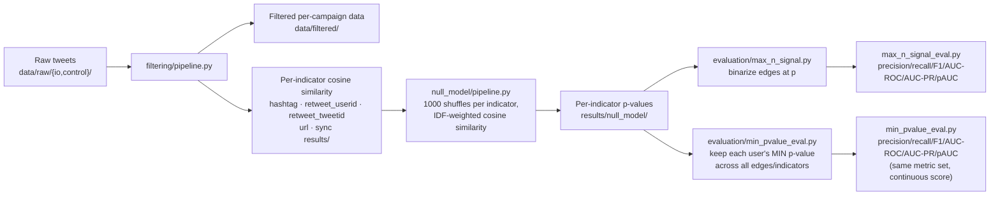

# Coordination Detection: IO vs. Control Accounts

Detects coordinated inauthentic behavior by testing whether accounts
labeled as part of an influence operation (**IO**) behave more similarly
to each other than a **control** group of accounts does, across several
independent behavioral indicators using a permutation-based null model
rather than an arbitrary similarity cutoff.

## Overview

For each campaign (a labeled dataset of IO + control accounts and their
tweets), the pipeline:

1. Filters raw tweet data and computes pairwise cosine similarity between
   accounts on 5 behavioral indicators: shared hashtags, shared retweeted
   users, shared retweeted tweets, shared URLs, and temporal
   co-posting ("sync").
2. Asks, for every pair of accounts and every indicator: *is this
   similarity higher than we'd expect by chance?* answered by
   repeatedly shuffling the data and rebuilding the same similarity
   metric, giving each pair a p-value against a null distribution
   specific to that campaign and indicator (not an arbitrary
   similarity threshold).
3. Aggregates each user's evidence across indicators into a single score,
   two different ways (see [Method](#method)), and evaluates how well
   that score separates IO from control accounts.

## The problem with existing methods

**1. Raw similarity thresholds have no statistical grounding.** "Cosine
similarity > 0.5" doesn't account for the fact that similarity on a
popular hashtag or a viral retweet arises easily by chance — it has no
notion of *how surprising* a given similarity actually is for this
specific campaign's data. The null model fixes this directly: every
p-value answers "how often would random accounts hit this similarity by
chance," calibrated per campaign, per indicator.

**3. Binarizing-then-counting throws away information the data actually
has.** The original approach (`max_n_signal`) marks each edge
significant/not-significant at `p < α`, then counts how many indicators
clear that bar per user. Because only a few indicators end up
contributing usable edges, that count typically only takes 3–4 distinct
values a very coarse classifier score. The alternative built here
(`min_pvalue`) skips binarizing and uses each user's single lowest
p-value directly as a continuous score and thresholds.

**4. AUC-ROC alone is misleading under class imbalance.** IO accounts are
typically a small minority (2%–34% of users across these campaigns). A
no-skill classifier's AUC-ROC is always 0.5, but its AUC-PR is the
positive rate not 0.5 so raw AUC-PR numbers aren't comparable across
campaigns with different IO/control ratios on their own. Every evaluation
here reports `auc_pr_lift` (= AUC-PR ÷ that campaign's own positive rate)
alongside AUC-ROC specifically to correct for this.

**5. A "best F1" threshold picked from the same data being scored is
optimistic, especially with few positives.** Every `best_f1_summary` row
selects its threshold by searching all achievable thresholds *in that
same evaluation set*.

## Method



- **[filtering/pipeline.py](filtering/pipeline.py)** loads raw IO +
  control tweets per campaign, filters by activity thresholds, computes
  cosine similarity per indicator.
- **[null_model/pipeline.py](null_model/pipeline.py)** the statistical
  core: for each indicator, repeatedly shuffles which value (hashtag,
  retweet target, etc.) each tweet points to, rebuilds the same
  similarity metric each time, and derives a p-value per pair from where
  the real similarity falls in that shuffled distribution. See
  `null_model/README.md` for why `client` is excluded and which of the
  several historical `null_model_*.py` variants at the repo root this is
  based on.
- **[evaluation/max_n_signal.py](evaluation/max_n_signal.py)** +
  **[max_n_signal_eval.py](evaluation/max_n_signal_eval.py)** the
  count-based path: FDR-correct each indicator's p-values, count how many
  indicators are significant per user (`max_n_signal`), score it as an
  IO/control classifier.
- **[evaluation/min_pvalue_eval.py](evaluation/min_pvalue_eval.py)** 
  the continuous-score path: per user, take the single lowest p-value
  across every edge/indicator, score it directly (no binarizing).
- **[evaluation/results.ipynb](evaluation/results.ipynb)** loads and
  visualizes the count-based path's evaluation output interactively.
- **[run_pipeline.py](run_pipeline.py)** one entry point chaining
  filtering → null_model → min_pvalue_eval per campaign (each stage run
  as its own subprocess).

## Repo layout

```
data/raw/{io,control}/      raw per-campaign tweet data (input)
data/filtered/              filtered per-campaign data (filtering output)
results/                    per-indicator similarity edge lists (filtering output)
results/null_model/         per-indicator p-values (null_model output)
results/max_n_signal/       per-user significant-indicator counts + Mann-Whitney tests
results/max_n_signal_eval/  count-based classifier evaluation
results/min_pvalue_eval/    per-user min p-values + continuous-score classifier evaluation
filtering/, null_model/, evaluation/   the runnable, maintained pipeline.
```

## Setup

Installed as an editable package (`pyproject.toml`), so `filtering`,
`null_model`, and `evaluation` are importable from anywhere (a notebook,
another script) as well as runnable as standalone scripts.

```bash
python3 -m venv .venv
source .venv/bin/activate
pip install -e .              # add extras as needed: -e ".[mpi,notebook]"
```

Once installed, the three pipeline stages are available anywhere as console
scripts, filter the raw data, run the null model on the filtered output,
then evaluate:

```bash
null-model-filter --campaigns spain_082019_1        # data/raw -> data/filtered, results/
null-model-run --campaigns spain_082019_1           # results/ -> results/null_model/ (p-values)
null-model-eval-min-pvalue --campaigns spain_082019_1  # results/null_model/ -> results/min_pvalue_eval/
```

Each also runs equivalently as `python filtering/pipeline.py`, `python
null_model/pipeline.py`, `python evaluation/min_pvalue_eval.py` — see
[Usage](#usage) below for the full CLI and library options.

## Usage

```bash
# Full pipeline, all campaigns found in data/raw/io/:
python run_pipeline.py

# One campaign:
python run_pipeline.py --campaigns spain_082019_1

# Re-run just the eval stage against existing null_model output:
python run_pipeline.py --skip-filtering --skip-null-model

# The count-based path (separate, not in run_pipeline.py yet):
python evaluation/max_n_signal.py
python evaluation/max_n_signal_eval.py
```

Each stage script also runs standalone with its own CLI, and the same
entry points are installed as console scripts after `pip install -e .`:
`null-model-filter`, `null-model-run`, `null-model-eval-min-pvalue`,
`null-model-eval-max-n-signal`.

### As a library

```python
from evaluation.min_pvalue_eval import evaluate_campaign
from null_model.pipeline import run_campaign_indicator

df = evaluate_campaign("spain_082019_1")
```

## Results

`*_fdr` = Benjamini-Hochberg FDR-corrected p-values. `lift` = AUC-PR ÷
that campaign's own IO base rate (see problem #4 above) 1.0x means "no
better than random."

| campaign | n_io | n_control | max_n_signal AUC-ROC | max_n_signal lift | min_pvalue AUC-ROC | min_pvalue lift |
|---|---:|---:|---:|---:|---:|---:|
| armenia_202012 | 26 | 1,104 | 0.52 | 1.3x | 0.66 | 20.7x |
| spain_082019_1 | 179 | 1,056 | **0.80** | **2.1x** | 0.64 | 1.3x |
| thailand_092020 | 208 | 1,926 | **0.89** | **7.9x** | 0.86 | 2.9x |
| uae_082019_1 | 3,349 | 6,638 | 0.63 | 1.3x | **0.89** | **2.6x** |
| venezuela_201901_2 | 501 | 4,316 | 0.18 | 0.8x | 0.24 | 2.4x |


